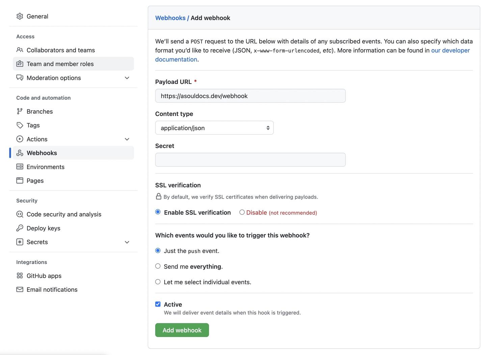

Obviously, you don't want to login to your server and update documentation manually every time you make a change, especially when changes are small and frequent.

This is a solved problem for the _**ASoulDocs**_ server.

Just two simple steps:

1. [Set up your documentation from a remote Git address](set-up-documentation.md#target)
1. Fire a webhook whenever there is a `push` event.

The URL path for receiving the webhook is `/webhook`, and it accepts any kind of HTTP method, GET, POST or HEAD? Cool with that.

Therefore, a simple `curl` can do the trick:

```bash
$ curl http://localhost:5555/webhook
```

Almost all code hosts provide builtin webhook, to configurate the webhook on GitHub, navigate to your repository **Settings > Webhooks**, then click on the **Add webhook** button:


